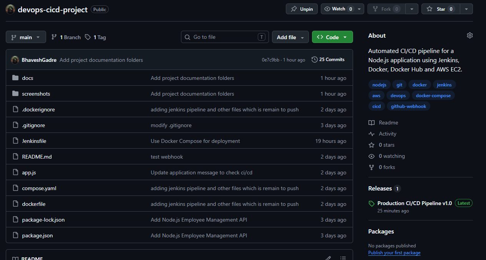
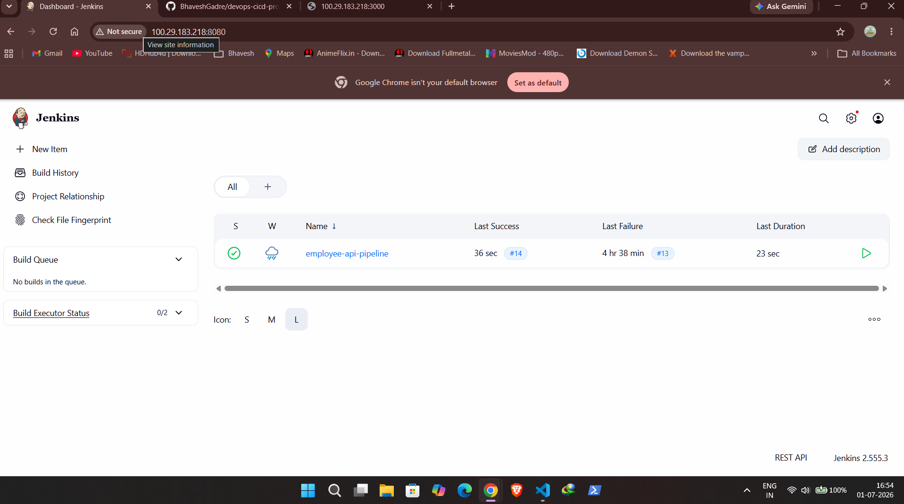
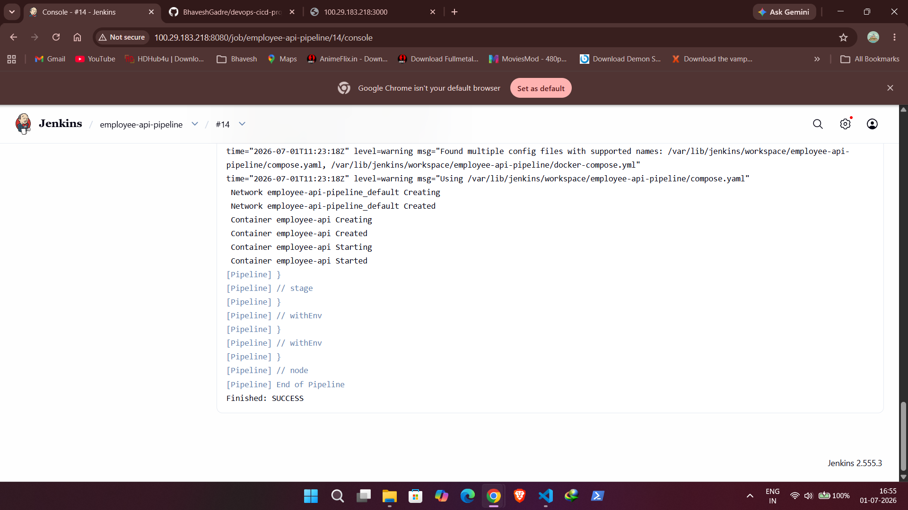
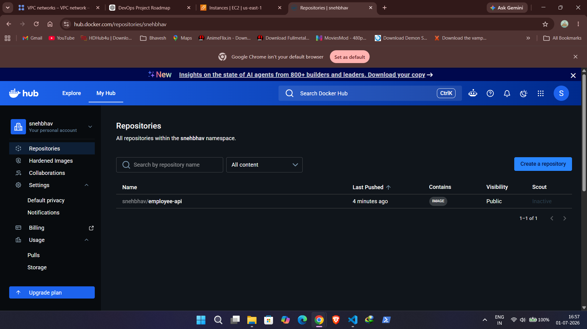
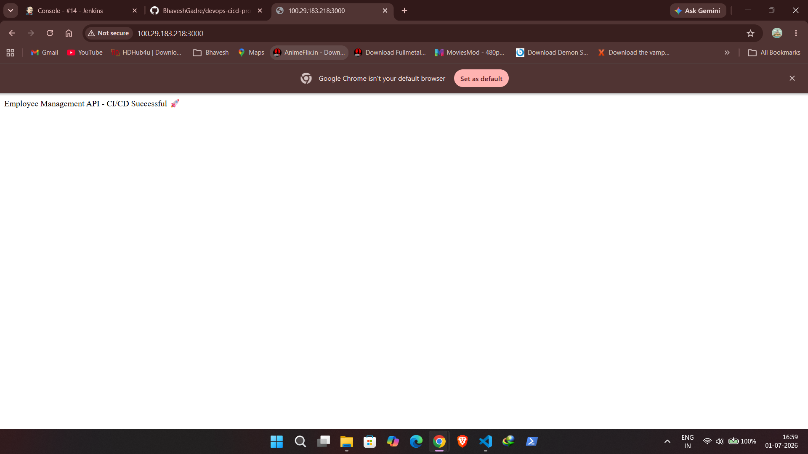
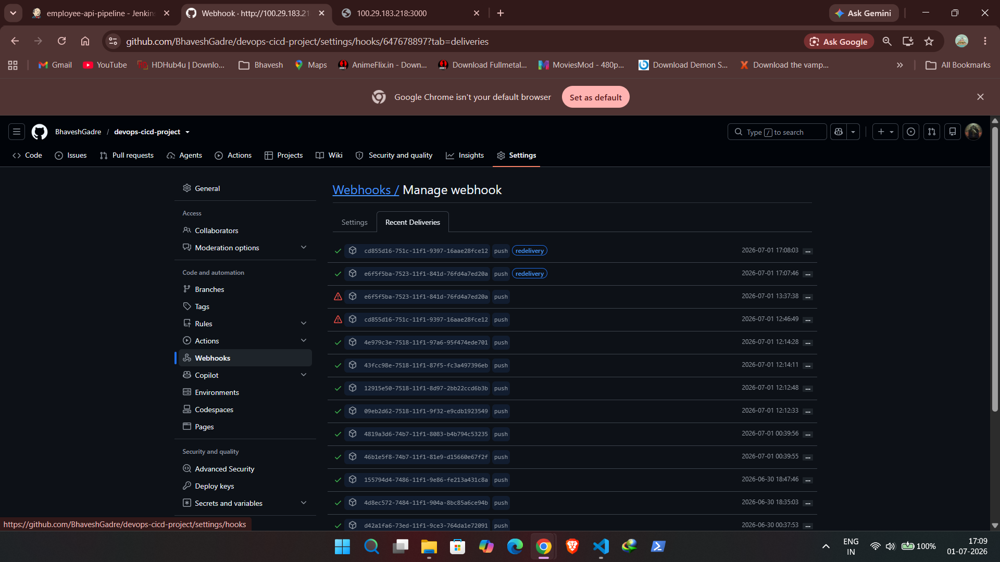

#  DevOps CI/CD Pipeline for Node.js Application

##  Project Overview

This project demonstrates an end-to-end CI/CD pipeline for deploying a Node.js application using Jenkins, Docker, Docker Hub, GitHub Webhooks, and AWS EC2.

Whenever code is pushed to the GitHub repository, Jenkins automatically triggers a pipeline that builds a Docker image, pushes it to Docker Hub, and deploys the latest version of the application on an AWS EC2 instance.

This project showcases practical DevOps skills including Continuous Integration, Continuous Deployment, containerization, and cloud deployment.


#  Architecture

```
Developer
    │
    │ Git Push
    ▼
GitHub Repository
    │
    │ Webhook
    ▼
Jenkins Pipeline
    │
    ├── Checkout Source Code
    ├── Build Docker Image
    ├── Push Image to Docker Hub
    └── Deploy Latest Container
            │
            ▼
        Docker Engine
            │
            ▼
      Node.js Application
            │
            ▼
     AWS EC2 Instance
```


#  Tech Stack

* Git & GitHub
* GitHub Webhooks
* Jenkins
* Docker
* Docker Hub
* Docker Compose
* AWS EC2 (Ubuntu)
* Node.js
* Linux


#  Repository Structure

```
.
├── docs/
├── screenshots/
├── app.js
├── compose.yaml
├── dockerfile
├── Jenkinsfile
├── package.json
├── package-lock.json
├── README.md
└── .gitignore
```


#  CI/CD Pipeline Workflow

1. Developer pushes code to GitHub.
2. GitHub Webhook automatically triggers Jenkins.
3. Jenkins checks out the latest source code.
4. Docker image is built.
5. Docker image is tagged.
6. Docker image is pushed to Docker Hub.
7. Existing container is stopped.
8. Latest image is deployed on AWS EC2.
9. Application becomes available automatically.

#  Features

* Automated CI/CD Pipeline
* Dockerized Node.js Application
* Automatic Deployment
* GitHub Webhook Integration
* Docker Hub Image Management
* AWS EC2 Deployment
* Jenkins Declarative Pipeline
* Zero Manual Build Process


#  Project Screenshots

## GitHub Repository




## Jenkins Dashboard




## Successful Pipeline Execution




## Docker Hub Repository




## Running Application




## GitHub Webhook




#  How to Run

Clone the repository

git clone <repository-url>

Install dependencies

npm install

Run the application

npm start

Build Docker Image

docker build -t employee-api:v1 

Run Docker Container

docker run -d -p 3000:3000 employee-api:v1


#  Key Learnings

* CI/CD Pipeline Design
* Jenkins Pipeline Automation
* Docker Image Creation
* Docker Hub Integration
* GitHub Webhooks
* AWS EC2 Deployment
* Linux Administration
* Git Branch Management


#  Future Improvements

* Kubernetes Deployment
* Terraform Infrastructure
* SonarQube Code Analysis
* Trivy Security Scanning
* Prometheus Monitoring
* Grafana Dashboard
* AWS ECR Integration


#  Author

**Bhavesh Gadre**

Aspiring DevOps & Cloud Engineer

Focused on AWS, Docker, Kubernetes, Jenkins, Terraform and Cloud Automation.
